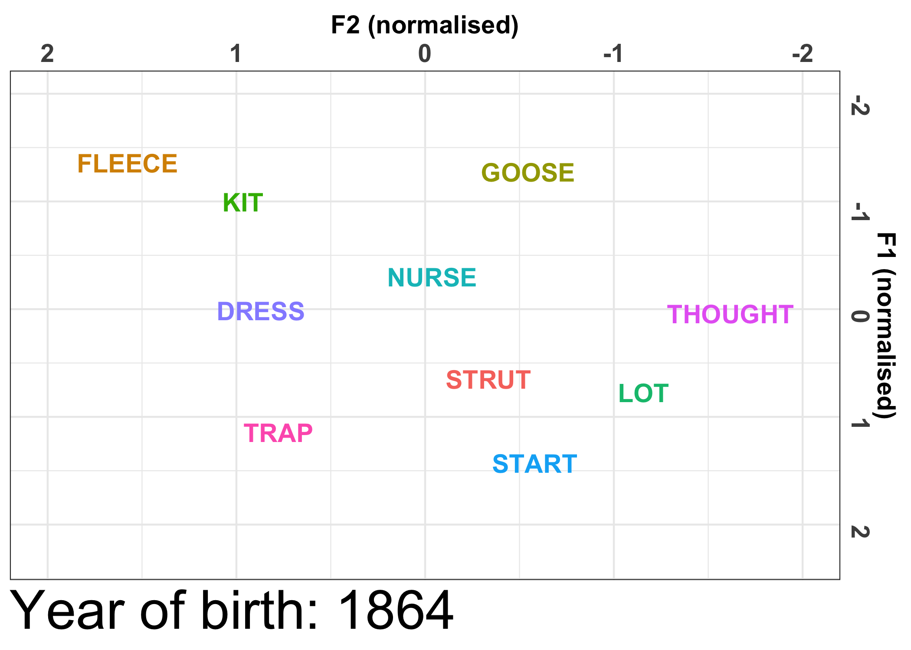

### Systematic co-variation of monophthongs across speakers of New Zealand English

This Shiny app allows users to interactively explore the results of the analysis
reported in the Brand, Hay, Clark and Watson (submitted) paper.

It provides visualisations of the data that will help explain and assist with the
interpretation of the 3 main principal components (`PCA explorer` tab). It also shows how these results
compare to the patterns of sound change in NZE (`Sound change` tab).

---

#### `PCA explorer`

The key trends in each principal component are demonstrated by 3 plots:

* **Speaker PC scores (left plot)**

	This plot presents each individual speaker in the dataset (represented by the **F**
	or **M** points, for female and male speakers
	respectively), with their year of birth plotted on the x axis and the speaker PC score
	on the y axis.

	By clicking on a speaker you can access their demographic information (shown within
	the tooltip). Clicking on a speaker will generate their vowel space (middle plot).

* **Vowel space (middle plot)**

	This plot is reactive and responds to the speaker you click on in the PC scores plot.
	When you click on a speaker, this will generate their vowel space, with normalised F1/F2
	values on the y and x axis respectively. The vocalic variables that are considered
	important to the principal component are presented in colour and a larger font size,
	all other variables are in gray.

* **Vocalic variables schematic (right plot)**

	This plots gives a schematic of how the vocalic variables vary in each
	principal component based on the PC scores. The plot functions to assist
	the user with their interpretation of the principal component, by showing how the
	locations of the vowels may differ based on the speaker PC score (i.e. from negative to
	positive scores).

	If a vocalic variable has a vertical trajectory, this indicates change in the vowel's F1
	values. If it is horizontal, this indicates change in F2 values. If it is diagonal, then
	this would indicate change in both F1 and F2 values.

	---

#### `Sound change`

You can interactively explore the trends in both the sound change analysis and the PC score
analysis by setting the year of birth or PC score parameters.

Below is an animated version of the sound change from the modelling analyses.

